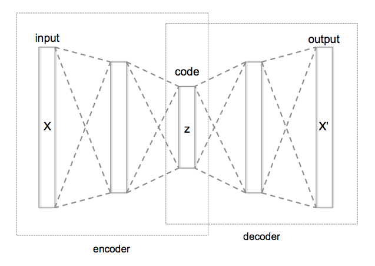

## Authors
* [Christopher Clint Pacillos](https://app.identifi.com/profile/0095e202d60a44b88bc75ca97c266e2e)

## Goal Statements

The goal of this experiment is to establish and demonstrate a workflow in solving or building Data Science applications using ML tools.
This experiment will include (but not limited to) the following objectives:

1. To identify the requirements for the application or problem to be solved.
    - What type of problem is being solved?
    - What algorithm is more appropriate to use to solve the problem?
2. To know the methodologies in data preprocessing.
    - Acquiring/Gathering data.
    - Data manipulation or clean up.
    - Encoding data
    - Splitting of dataset (training and test datasets)
    - Feature scaling
3. To design and build models.
4. To be able to train and validate models.

This experiment does not aim towards complex methodologies or even very high accuracy of models built but rather focuses more on the processes and workflow needed in dealing with such problems.

## Abstract

In this experiment, I am going to build a model that detects anomaly in the logs generated in OneWallet system. Generally speaking, the problem here is a binary classification of time series data. More specifically, our model will tell us whether a given set of logs in a fixed and consistent time window is good or anomalous.

As this experiment aims to establish a set of processes, to reduce complexity, I am going to focus on logs that pertains to the response times of internal APIs in OneWallet.

My approach in solving this problem is to train a model for it to learn to be very good at processing a time series of logs that we consider to be normal or good, but fails to a high degree in processing a time series of logs that we consider to be anomalous. More specifically, the model should generate a significantly greater loss in processing an anomalous set of logs compared to processing a good set of logs.

For this approach I'm going to use Autoencoder.

The basic idea here is:
  1. We have a time series of response times logs (in consistent intervals) as input.
  2. We are going to learn a latent representation of that input.
  3. Reconstruct the input from the latent representation.
  4. Measure the error.

Planned Steps:
  1. Retrieve logs for response times for every 1 minute interval.
  2. Normalize the points to be between 0 and 1. Make sure data is consistent and dimensionality is right.
  2. For the training data, filter only those data we consider to be normal or good and use that as our `training_normal_logs`.
  3. Train the model with using `training_normal_logs` and determine the training loss to establish a threshold.
  4. Input logs that will generate loss greater than the threshold should be anomalous.

In this experiment, I will be using Keras with TensorFlow as backend.

## Conclusion

## Resources
- [Anomaly detection with TensorFlow | Workshop](https://www.youtube.com/watch?v=2K3ScZp1dXQ)
- [Anomaly Detection: Definition, Best Practices and Use Cases](https://datrics.ai/anomaly-detection-best-practices)
